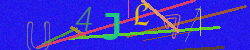

# About
Simple text captcha generator and solving solution based on yolo v5 nn.

## How does this work (in theory)
1) Generate large amount of captchas matching our criterias;
2) train yolo v5 neural network on generated data;
3) use trained model to solve captchas.

## How can you use this project
1) To generate text captchas with different parameters, from very simple ones to
quite complicated

 
 

2) To potentially teach yolo neural network model to solve this type of captchas

# TODO:
1) Create jupyter notebook for training yolo neural network (on gpu, for example google colab or kaggle)
2) Create scripts for using and testing trained model
3) Make an easy to use module from notebook that generates captchas

# Author
[AppleJack-coder](https://github.com/AppleJack-coder)
